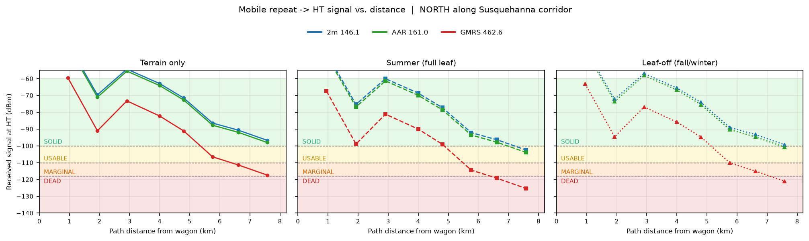
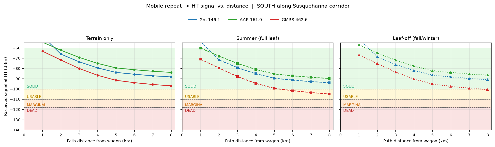
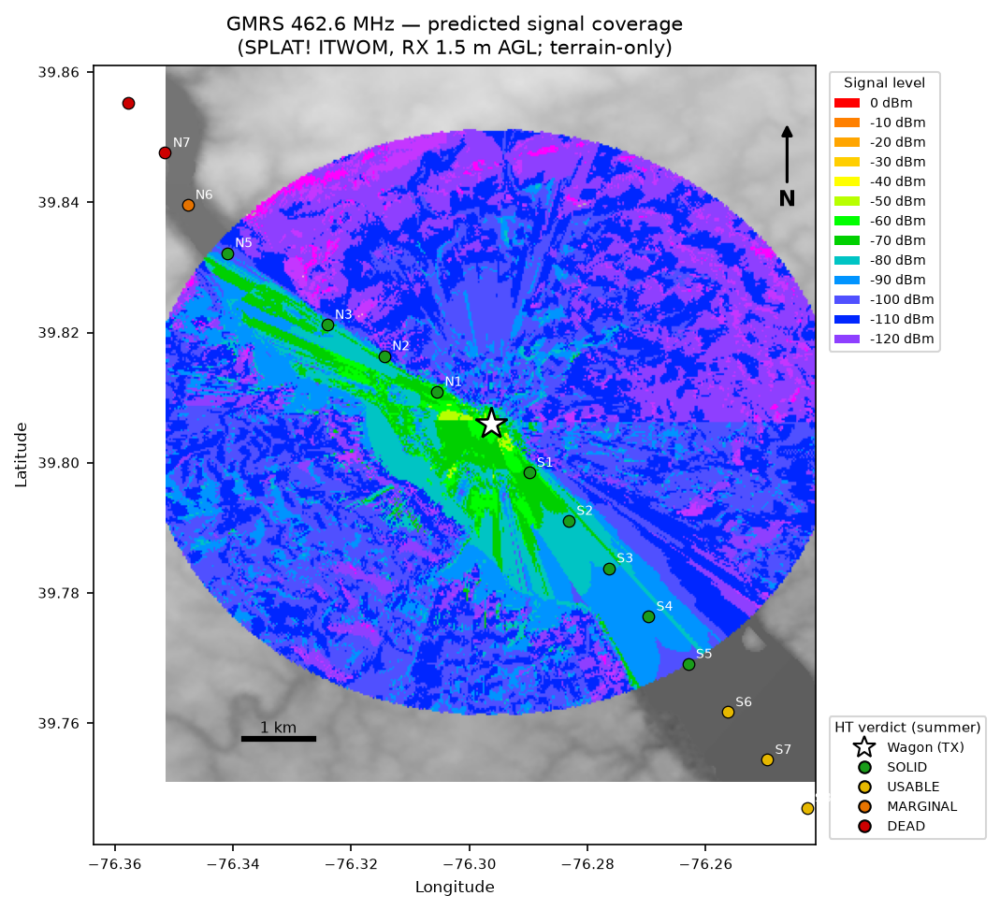
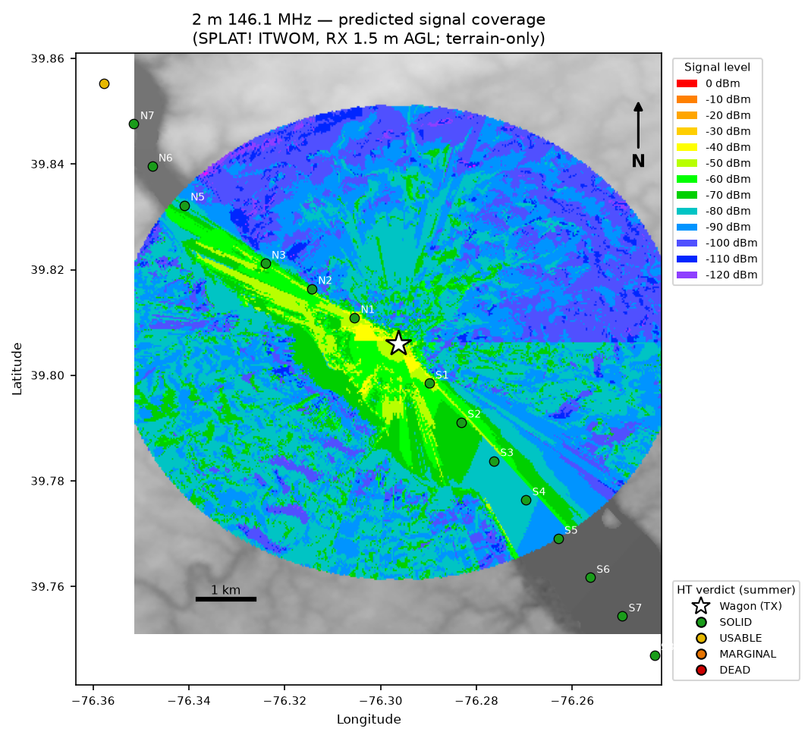
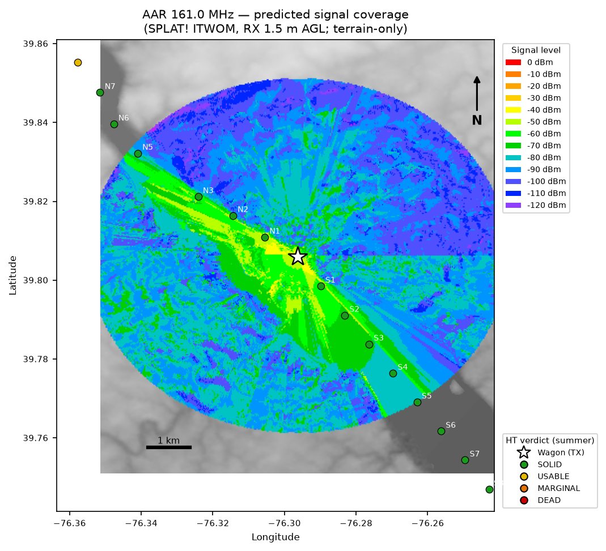
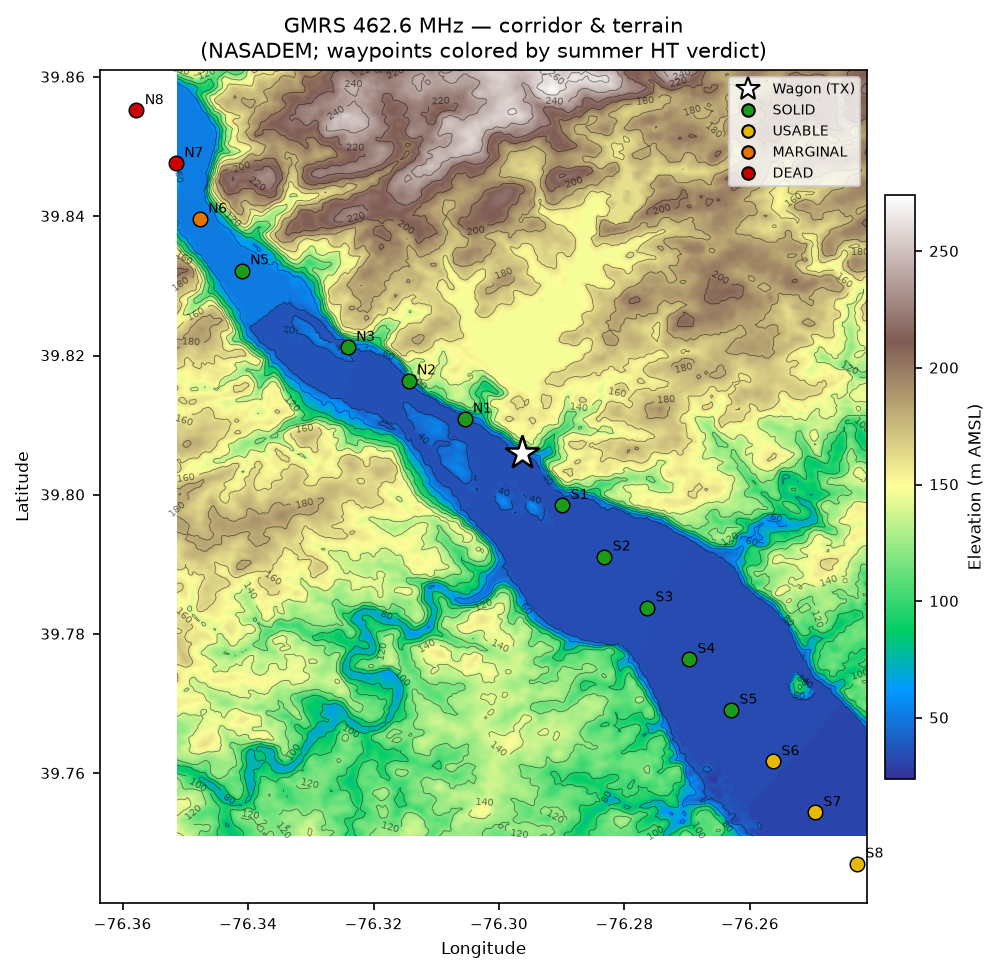

# Summary

This study evaluates whether a **mobile cross/same-band repeat** operated from a
mobile communications vehicle parked at the Muddy Run (Wissler Park) can reach a
**handheld (HT) carried on foot** along the Lancaster-side of the Susquehanna 
River, along Norfolk Southern's Port Road Branch between Holtwood (MP 25.0) and 
Midway (MP21.7) specifically, plus a further 3-5 mi north and / or south.

The comm vehicle sits essentially on the valley floor — **~102 m below the average
surrounding terrain** — which at first glance appears to be poor coverage. It is 
not for this mission: the HT travels the *same low corridor*, so signal propagates
**along the valley** rather than fighting uphill over ridges. All three bands 
analyzed deliver usable HT coverage across the full hiking range, with one 
frequency- and direction-dependent exception.

**Headline result (terrain + summer foliage):**

- **2M (146.1 MHz)** and **AAR VHF (~161.0 MHz)** — solid copy the entire 5 miles,
  both directions. These are the reliable choices for the repeat leg.
- **GMRS (462.6 MHz)** — solid to ~3 miles both ways; **going north it degrades
  to marginal/dead past ~5.5 km** in summer foliage. South, GMRS stays usable
  the whole way.
- **Seasonal effect:** leaf-off (fall/winter) recovers ~4 dB on UHF and ~3 dB on
  VHF, pulling the GMRS-north dead zone back toward marginal. The wooded corridor
  measurably improves as the leaves drop.

# Objective and operational context

The operator hikes along the Susquehanna, monitoring rail (AAR VHF), GMRS, APRS
and 2 m repeaters. The comm wagon — with capable roof/fender antennas and good
receivers — pulls in distant signals that a handheld cannot. The question is the
**outbound relay leg**: when the wagon re-transmits to the HT the operator 
carries up and down the corridor, *how far does that repeat hold up?*

The comm vehicle is fixed (a riverside park). The requirement is **not** to
defeat the valley in all directions — it is to reach the operator along the
paths actually hiked, which follow the river/rail corridor and occasionally
climb onto the adjacent Lancaster-side high ground.

# Method

## Propagation engine and terrain

- **Engine:** SPLAT! HD v1.4.2 using the **ITWOM 3.0 / Longley-Rice Irregular
  Terrain Model**. ITWOM models terrain diffraction and ground reflection; it
  does **not** model vegetation (handled separately, below).
- **Terrain data:** **NASADEM 1-arc-second (~30 m)**, void-filled and
  error-corrected, tile `N39W077` covering the study area. HD (`splat-hd`) tools
  and 1-arc-second data were used throughout for ridge/diffraction fidelity.
- **Transmitter (com vehicle):** 39.8059656, -76.2963533; antenna 2.0 m AGL (vehicle
  roof/fender). Ground elevation 40 m AMSL (valley floor; -102 m below average
  terrain).
- **Receiver (HT):** 1.5 m AGL (head height).
- **ITWOM environment:** earth dielectric 15, conductivity 0.005 S/m, N = 301,
  radio climate 5 (continental temperate), **vertical polarization** (FM),
  90 % of situations / 90 % of time.

## Per-band parameters

| Band | Freq (MHz) | ERP (W) | Wagon antenna |
|------|-----------:|--------:|---------------|
| GMRS     | 462.6 | 45 | Laird C150/450C fender collinear |
| 2 m      | 146.1 | 50 | Antenex B1443 5/8-wave roof |
| AAR VHF  | 161.0 | 55 | Laird C150/450C fender collinear |

## Corridor tracing

The hiking corridor was traced directly from the DEM by a **low-ground
follower**: starting at the wagon, stepping 250 m at a time along the general
up-river (NW, ~325°) and down-river (SE, ~145°) bearings, at each step choosing
the lowest-elevation neighbor within ±70° so the track hugs the river channel.
Waypoints were recorded every ~1 km out to 8 km in each direction (N1–N8,
S1–S8). This approximates the rail/river corridor closely without requiring
surveyed trail coordinates.

## Point-to-point analysis

For each of the 3 bands x 2 directions x 8 waypoints (**48 links**), a SPLAT! HD
path analysis was run from the wagon to the waypoint, extracting ITWOM path
loss, terrain-shielding loss, received signal power (dBm), and the dominant
propagation mode.

*One waypoint (N4, ~4 km north) triggered an ITWOM numerical edge case that
hangs before writing its report; its received level is interpolated from the
bracketing N3/N5 results and flagged as such in the data.*

## Foliage correction (two seasons)

Vegetation loss — absent from ITWOM — was applied as a separate layer using the
**Weissberger modified exponential-decay model**, evaluated at two effective
foliage depths representing the wooded corridor:

- **Summer (full leaf):** 30 m effective vegetation depth.
- **Leaf-off (fall/winter):** 10 m effective depth (trunks/branches only).

These depths are first-order estimates for an intermittently wooded river/rail
corridor and are the dominant assumption in the seasonal comparison. Resulting
excess loss:

| Band | Summer foliage loss | Leaf-off loss | Seasonal gain |
|------|--------------------:|--------------:|--------------:|
| GMRS 462.6 | 7.9 dB | 3.6 dB | **4.3 dB** |
| 2 m 146.1  | 5.7 dB | 2.6 dB | **3.1 dB** |
| AAR 161.0  | 5.8 dB | 2.7 dB | **3.2 dB** |

Higher frequency suffers more foliage loss and therefore gains the most from
leaf-off — which is exactly where the GMRS-north edge case lives.

## Usable-signal thresholds (received power at the HT)

| Verdict | dBm | Meaning |
|---------|-----|---------|
| SOLID    | at or above -100 | full quieting / easy copy |
| USABLE   | -100 to -110 | readable, some noise |
| MARGINAL | -110 to -118 | breaking up |
| DEAD     | < -118 | below usable HT sensitivity |

# Results

## Signal vs. distance

The clearest view is received HT signal against corridor distance, per band,
under each foliage state, with the usable-signal bands shaded.





Key reads:

- **VHF (2 m, AAR) stays in the SOLID band the full 8 km both directions**, in
  every foliage state. These bands own the corridor.
- **GMRS holds SOLID to ~3 miles**, then diverges by direction:
  - **South:** remains USABLE to the full 8 km (gentler, single-horizon terrain).
  - **North:** the up-river double-horizon terrain drives increasing shielding
    (up to ~63 dB); GMRS crosses into MARGINAL near 5.5 km and, **with summer
    foliage, into DEAD beyond ~6.5 km**.
- **The three-panel progression** (terrain -> summer -> leaf-off) shows the whole
  family of curves shifting down ~6–8 dB in summer and recovering in leaf-off —
  visually confirming the seasonal improvement.

## GMRS north — the one problem area, and its seasonal recovery

| North waypoint | Path km | dBm terrain | dBm summer | dBm leaf-off | Summer verdict | Leaf-off verdict |
|---------------:|--------:|------------:|-----------:|-------------:|:--------------:|:----------------:|
| N5 | 4.80 | -91.1 | -99.0 | -94.7 | SOLID | SOLID |
| N6 | 5.76 | -106.5 | -114.4 | -110.1 | MARGINAL | MARGINAL |
| N7 | 6.61 | -111.3 | -119.2 | -115.0 | **DEAD** | MARGINAL |
| N8 | 7.58 | -117.4 | -125.3 | -121.0 | **DEAD** | DEAD |

Leaf-off recovers N7 from DEAD back to MARGINAL — a real, usable operational
difference for fall/winter train chasing.

## Coverage maps

SPLAT! area-coverage maps (ITWOM signal-power contours over shaded terrain
relief, HT at 1.5 m AGL, 5 km radius) confirm the corridor-following behavior —
coverage extends along the low ground and is shadowed by the surrounding rises.
The wagon (white star) and corridor waypoints (colored by summer HT verdict) are
overlaid; the signal-level color key is at right.







The same corridor is shown below on a NASADEM elevation-contour base, making the
valley structure explicit — the wagon sits in the drainage and the waypoints
follow the low ground north and south. Waypoint markers are colored by the
summer HT verdict for that band.




# Discussion

- **The valley "hole" is not the enemy for a corridor mission.** The -102 m
  below-average-terrain figure describes an omnidirectional disadvantage, but the
  operator and the wagon share the drainage. Signal follows the corridor; the
  metric that mattered was *along-corridor* diffraction, not average-terrain
  clearance.
- **Frequency choice is the lever.** All paths are diffraction-dominated (no true
  line-of-sight). Lower frequency diffracts better, so **VHF outperforms UHF**
  along the wooded, terrain-broken corridor. For maximum reliable range —
  especially north — **operate the repeat leg on 2 m or AAR VHF**. Reserve GMRS
  for the ~3-mile solid zone and the southern corridor.
- **Season matters, predictably.** Summer foliage costs ~6–8 dB; leaf-off returns
  most of it. The practical upshot: **GMRS reach north improves in fall/winter**,
  the prime train-chasing season anyway.

# Limitations

- **Foliage depths are estimates**, not measured. The 30 m / 10 m summer/leaf-off
  effective depths are first-order; actual loss varies with specific tree density
  and path geometry. The *relative* seasonal comparison is more robust than the
  absolute dB.
- **Weissberger is an empirical bulk model**, applied uniformly along each path;
  it does not resolve where along the route the trees actually are.
- **Antenna patterns are not yet modeled** — ERP is treated as into an idealized
  pattern. The fender-mounted C150/450C in particular is slightly directional in
  the real install (vehicle-body interaction), not captured here.
- **N4 (north, ~4 km) is interpolated** due to an ITWOM edge case.
- **ITWOM 90/90 confidence** — results are the 90 %-of-situations / 90 %-of-time
  prediction, appropriately conservative.

# Reproducibility

All inputs, code, and derived data are in the `Splat_RF_Analysis` repository:

- Study definition: `studies/muddy_run_corridor/study.yml`
- Corridor trace: `splat_rf/corridor/trace.py`
- Results build (parse + foliage): `splat_rf/corridor/build_results.py` ->
  `studies/muddy_run_corridor/results.csv`
- Plots: `splat_rf/corridor/plot_signal.py`
- KML export: `splat_rf/corridor/build_kml.py` -> `reports/figures/kml/`
- PostGIS load: `splat_rf/corridor/load_postgis.py` (schema `rf_analysis` in
  `gis_dev`; 16 sites + 48 path_profiles, QGIS-loadable)
- Terrain (not in repo, per big-data-on-/data rule): `/data/splat/sdf/`

Render this report to PDF:

```
pandoc reports/muddy_run_corridor.md -o reports/muddy_run_corridor.pdf \
  --pdf-engine=xelatex -V geometry:margin=1in --toc --number-sections
```
